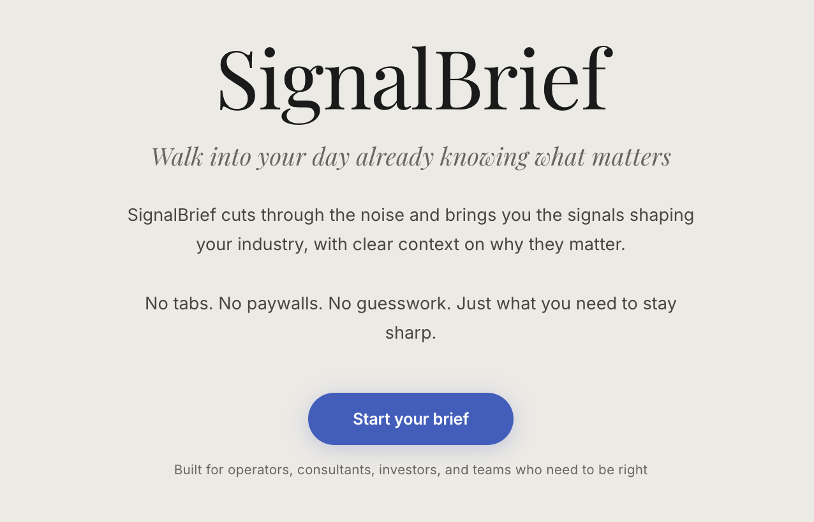
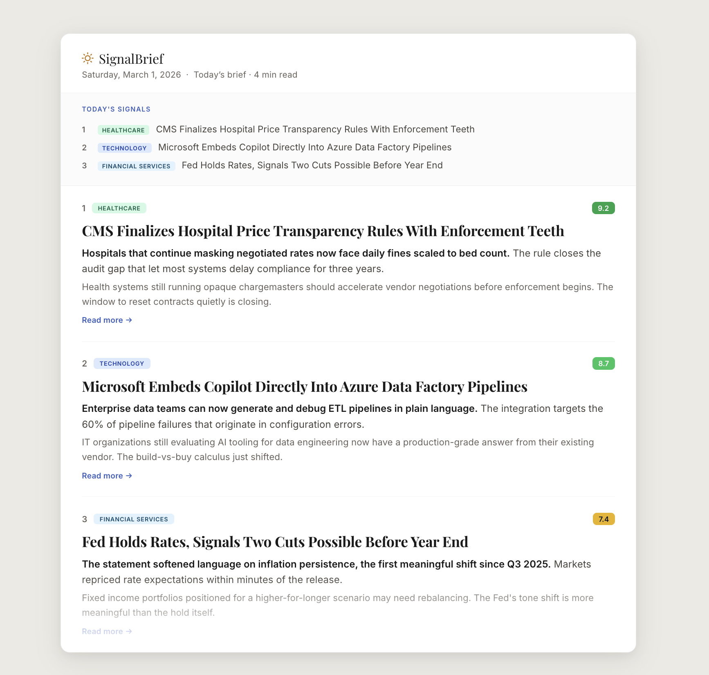

<h1 align="center">SignalBrief</h1>

<p align="center">
  <strong>The daily sector briefing for operators, investors, consultants, and strategy teams.</strong>
</p>

<p align="center">
  <a href="https://getsignalbrief.com"><strong>Website</strong></a>
  &nbsp;&nbsp;|&nbsp;&nbsp;
  <a href="https://getsignalbrief.com/signup"><strong>Start Your Brief</strong></a>
  &nbsp;&nbsp;|&nbsp;&nbsp;
  <a href="./docs/INDEX.md"><strong>Documentation</strong></a>
</p>

<p align="center">
  
</p>

SignalBrief is built for people who need to walk into the day informed without burning the morning on tab sprawl.

Instead of juggling tabs, feeds, newsletters, and search results, SignalBrief delivers a tight briefing built from trusted trade and official sources, with clear context on why each story matters and a reading depth that matches your day.

<p align="center">
  
</p>

## Why SignalBrief

- A better morning read: five selected signals per topic instead of a pile of links.
- Built for professionals: written for people who need to sound informed, not casually updated.
- Trusted source mix: trade press and official sources first, with discovery used to fill gaps rather than define the product.
- Flexible depth: the same selected stories can be read in `Scan`, `Brief`, or `Deep` mode.

## What You Get

| SignalBrief experience | What it means |
| --- | --- |
| `1-3` sectors | Build a briefing around the lanes you actually care about |
| `5` selected signals per topic | A concise, high-signal read instead of a headline firehose |
| `Scan`, `Brief`, or `Deep` | Move fast or go deeper without changing the story set |
| Fresh every morning | Built for the start of the workday, not end-of-day catch-up |

## Sector Coverage

`HEALTHCARE` · `LIFE SCIENCES` · `TECHNOLOGY` · `ENERGY` · `FINANCIAL SERVICES` · `CONSUMER & RETAIL` · `INDUSTRIALS`

## How It Works

1. Choose the sectors you want to follow.
2. Pick the reading depth that fits your workflow.
3. Get a daily email briefing built from curated source inputs and relevance scoring.
4. Open a brief that helps you get oriented quickly and go deeper when needed.

## Built For

- operators who need to see what is moving their market before meetings begin
- strategy and corp-dev teams covering multiple sectors at once
- investors and analysts who want a tighter, more usable morning signal set
- consultants who need to walk in informed without doing a full pre-market reading marathon

## Run Locally

Requirements:

- Node.js `22+`
- `.env` with required `SIGNALBRIEF_*` secrets
- `config.json` optional for local non-secret overrides

```bash
cp config.example.json config.json
cp .env.example .env
npm install
./start.sh
```

Local processes:

```bash
npm run web
npm run worker
```

Checks:

```bash
npm test
npm run smoke:worker
npm run smoke:admin-scheduler
```

## Runtime At A Glance

```text
scheduler-worker -> digest orchestrator -> topic selection -> email delivery
       |                    |                    |
       |                    |                    +-> delivery records + engagement events
       |                    +-> archive + audit + cost log
       +-> scheduler heartbeat + health surface
```

Primary processes:

- `src/entrypoints/scheduler-worker.js`
- `src/entrypoints/digest.js`
- `web/server.js`

## Documentation

Start here:

- [Documentation Index](./docs/INDEX.md)
- [Product Spec](./docs/reduced-scope-mvp.md)
- [Format Rules](./FORMAT-RULES.md)
- [Features and Backlog](./docs/features.md)

Engineering reference:

- [Repository Map](./docs/repository-map.md)
- [First 30 Minutes](./docs/onboarding-first-30-minutes.md)
- [Change-to-Test Map](./docs/change-to-test-map.md)
- [Path and Import Rules](./docs/contributing-path-rules.md)

Ops:

- [Ops Hub](./docs/ops/README.md)
- [Production Cutover Runbook](./docs/ops/production-cutover-ubuntu.md)
- [Reliability Floor Runbook](./docs/ops/reliability-floor-runbook.md)
- [Release Policy](./docs/ops/release-policy.md)
- [Source Quality Registry](./docs/ops/source-quality-registry.md)
- [Retrieval Eval Worklog](./docs/ops/retrieval-eval-worklog.md)

Historical material:

- [Archive Policy](./docs/archive/README.md)
- [March 2026 Planning Archive](./docs/archive/planning/2026-03/README.md)
- [March 2026 Marketing Archive](./docs/archive/marketing/2026-03/README.md)
- [March 2026 Strategy Archive](./docs/archive/strategy/2026-03/README.md)
